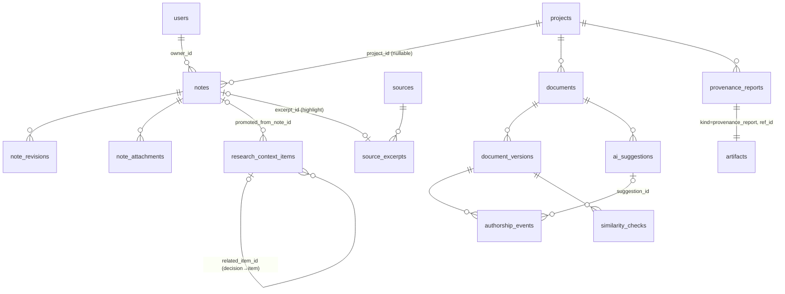

# Researcher workspace: design (X.31 redesign)

> Status: **design only, not approved for implementation**. Recorded 2026-10-06. See `plan.md` X.31 and §4 Q14–Q22 for the task list and open questions this design produced. No code has been written against this document yet.

## Context

The owner wants a design, not code yet, for a calm workspace where a researcher captures ideas and writes. Every piece of text keeps an automatic, trustworthy record of who wrote it and where it came from, so the researcher can show how the text was written. This step produces the design, the task list and the open questions, then **STOPS**. No production code until the owner explicitly approves the design and answers the blocking questions (Q14–Q22).

Grounding: `plan.md` already had **X.31** (Researcher workspace, P1, deps X.14) with subtasks X.31.1–X.31.5 all `[ ]`. Decisions log 2026-10-05 says: "plain JS + TipTap/ProseMirror, vendored, same-origin" and "ideas are project-scoped context items (`ContextKind.idea`), never sent to the agent". The test baseline is **1247 passed, 3 skipped**. The latest migration is `20261005_0027` (`20261005_0027_screening_decisions.py`). `M0.10.2` (object storage) is `[ ]` P2. **No task called "data-driven stages" exists** in `plan.md`, `docs/` or `stage_machine.py`. Stages are the fixed `ProjectStage` enum in `models.py`.

---

# Part A: For the owner (plain language)

## A1. What this is

A quiet writing space inside the research app. You can jot down an idea from anywhere in one step. Later you sort your ideas into projects and turn the good ones into hypotheses, decisions or paragraphs. You write in a clean editor with your sources beside the text. Behind the scenes, the app keeps a **writing record** (the "authorship ledger"). It notes, for every piece of text, whether you typed it, dictated it, pasted it (and from where), or accepted it from an AI suggestion (and which AI). When a supervisor, journal or university asks "how was this written?", you export a **Writing provenance report** and an **AI-use statement** generated from that record.

## A2. Principles (how it behaves)

1. **Your words are never changed by AI.** AI suggestions appear only in a side panel. Text enters your document only when you press "Insert". Your original stays in the version history.
2. **Capture is one step.** Press a key or tap the + button, type, done. No project, tag or stage is needed.
3. **The record keeps itself.** You never fill in authorship forms.
4. **Quiet screen.** Few buttons, a focus mode, plain words. Gentle hints, never warnings that block you or feel like policing.
5. **Honest claims only.** We say "writing record" and "similarity check". We never say "plagiarism-proof" or "AI-detector-proof".
6. **You own everything.** Export to Markdown, Word (DOCX), BibTeX or JSON at any time. Nothing you write goes to an AI service unless you press an AI button on that text. Before anything leaves the app, a hint says exactly what will be sent and where.

## A3. What the writing record can and cannot prove

**It can show:**
- For text written **in this app**: when it was written (writing sessions with dates and times), by which signed-in person, and how it got there: typed, dictated in the app, pasted, imported, or inserted from an AI suggestion (with the AI model name, the prompt version and the time).
- Which AI-inserted text you later changed, and by how much.
- Which pasted text you marked as your own, as a quotation (with its citation), or removed.
- The full version history. Nothing in the record can be edited or deleted afterwards, by you, by us or by the app itself (the database refuses).

**It cannot show (we state this in every report):**
- Anything written outside the app (in Word, on paper, in another AI chat) before it was pasted in. Pasted text is labelled "pasted", but the app cannot know who wrote it originally.
- Whether you typed out text you read elsewhere. Typing it by hand looks like typing.
- What an outside AI detector (Turnitin AI score, GPTZero and so on) will say. Those tools make their own guesses. The record is evidence of how the text was produced here. It does not guarantee any detector's output.
- The identity behind an account. If someone else uses your login, the record shows your name.
- That the server clock and server were not tampered with by whoever runs the server. A stronger, independent timestamp is open question Q20.

## A4. User journeys

1. **Idea on the phone, offline.** On a train with no signal, Priya taps **+**, types "Does remote work widen the gender wage gap in Kerala's IT sector?" and taps Save. The note is kept on the phone and shows "Waiting to sync". When signal returns, it uploads once (never twice), stamped with her name, the time she wrote it and "typed". If she edited the same note on her laptop meanwhile, she sees both versions side by side and chooses. Nothing is silently merged.
2. **Morning sort (inbox).** On her laptop, the inbox shows 6 new notes. Beside the remote-work note the app suggests: "Project: Gender wage inequality · related: 2 of your sources". She clicks the project chip to file it, then **Promote → Hypothesis** and edits the wording. The hypothesis keeps a permanent link "from note captured 3 Oct, 08:14". She also adds a decision: "Dropped H2 (wage-board data too sparse)", which is logged for the methods section.
3. **Write a paragraph from verified sources.** In the section "Background", she types her paragraph. Typing `@` opens a list of **verified** sources only, and she picks one, which inserts a citation. When she selects a sentence, the side panel shows the sources and excerpts it relies on. One sentence with a statistic but no citation gets a faint dotted underline and the hint "No source linked yet".
4. **Accept one AI suggestion.** She selects a clumsy sentence and clicks **Suggest a clearer sentence**. A hint first says: "This sentence (31 words) will be sent to *gpt-x via your provider*. Nothing else is sent." She confirms. Two proposals appear in the side panel. She clicks **Insert** on one, then changes two words. The record shows: "AI-edited (model, prompt `workspace_clearer_sentence@1`, 10:42), then 2 words changed by Priya". Her original sentence remains in version history.
5. **Paste and quote.** She pastes a sentence from a PDF. It shows a soft highlight: "Pasted. Is this your own text, a quotation or should it go?" The app recognises it as matching an excerpt of Sen (2019). She chooses **Quotation**, the app adds quotation marks and the Sen citation, and the highlight disappears.
6. **Similarity check before submission.** She clicks **Similarity check**. The app compares her section with the excerpts and abstracts stored in this project (on the server, nothing sent out). It flags one sentence as "very close to Kumar (2021), p. 4: quote it, or put it in your own words". The institutional check (Turnitin/iThenticate) button says "Not connected: ask your institution".
7. **Report for the supervisor.** She opens **Writing record → Create report** for the whole manuscript. The report shows writing sessions over 5 weeks, 91% typed, 4% quoted, 3% AI-edited then accepted (half of that changed by her afterwards), and 2% pasted and confirmed as her own. It lists every AI contribution with model and prompt version and every quotation with its source. A ready-to-paste AI-use statement is included. She exports PDF-ready Markdown and JSON and sends it. Her supervisor (project role "supervisor") can open the same report in the app.

## A5. Screen inventory and wireframes

|#|Screen|Where|Purpose|
|---|---|---|---|
|S1|Quick capture|Overlay from any screen (desktop key / mobile +)|Save a thought in one step|
|S2|Inbox|Top-level "Inbox" link in the left rail (above projects)|Sort raw captures|
|S3|Note detail|Opens from inbox|Read/edit a note, see its history, promote it|
|S4|Writing (editor + source panel + record view)|New step "Write" in the project's step rail|Write sections|
|S5|Writing provenance report|From editor "Writing record" menu|Evidence for supervisor/journal|
|S6|AI settings|Project → Team/Settings area (owner only to change)|Off / Suggestions / Full; local model; locks|
|S7|Decision log|Project → "Decisions" (view of decision items)|Why theories/hypotheses were chosen or dropped|

### S1 Quick capture (desktop overlay, `Alt+Shift+N` or `N` when not typing)

```
┌─────────────────────────────────────────────── × ┐
│  New note                                        │
│ ┌──────────────────────────────────────────────┐ │
│ │ |                                            │ │
│ │                                              │ │
│ └──────────────────────────────────────────────┘ │
│  [Type] [Voice] [Photo] [Clip link]   Project: — │
│                                   (optional) ▾   │
│  🔒 Never send to AI  ☐                          │
│                          Esc to close   [Save ⏎] │
└──────────────────────────────────────────────────┘
 Ctrl/Cmd+Enter saves. Saved notes go to your Inbox.
```

### S1 Quick capture (phone: + button opens a bottom sheet)

```
┌───────────────────────────┐
│ ...current screen...      │
│                           │
│                      (+)  │  ← always visible, bottom-right
└───────────────────────────┘
┌───────────────────────────┐
│ New note          Cancel  │
│ ┌───────────────────────┐ │
│ │ |                     │ │
│ └───────────────────────┘ │
│ [🎙 Voice] [📷 Photo] [🔗] │
│ ○ Offline: saved on this  │
│   phone, will sync later  │
│ [        Save          ]  │
└───────────────────────────┘
```

### S2 Inbox

```
┌ Rail ──────────┬ Inbox (6) ─────────────────────────────── [+ New] ┐
│ ▸ Inbox (6)    │ Filter: All ▾   Show: Inbox | Filed | Archived     │
│ Projects       │────────────────────────────────────────────────────│
│  Gender wage…  │ Does remote work widen the gender wage gap…        │
│  Kerala IT…    │ typed · 3 Oct 08:14 · phone                        │
│                │ Suggested: [Gender wage… ✓] [stage: Scoping]  ⋯    │
│ Decisions      │────────────────────────────────────────────────────│
│                │ 🔗 "Women's LFPR fell to…"  clip · thehindu.com    │
│                │ Suggested: [Gender wage… ✓]                    ⋯   │
│                │────────────────────────────────────────────────────│
│                │ 🎙 Voice note 0:42 · "talk to Dr. Nair about…"     │
│                │                                                ⋯   │
└────────────────┴────────────────────────────────────────────────────┘
 ⋯ = File to project · Promote ▸ (Idea, Gap, Hypothesis, Claim, Memo,
     Decision, Paragraph) · Never send to AI · Archive
 Suggestion chips: click ✓ to accept, × to dismiss, or ignore them.
```

### S3 Note detail

```
┌ ← Inbox ─────────────────────────────────────────────── ⋯ ┐
│ Does remote work widen the gender wage gap in Kerala's IT │
│ sector? Check Sen 2019 on care burden.                    │
│                                                           │
│ ── From elsewhere (not your words) ─────────────────────  │  (clips only)
│ "Women's LFPR fell to 32%…"  thehindu.com/… (link)        │
│                                                           │
│ typed by Priya · captured 3 Oct 08:14 (phone) · synced    │
│ 08:51 · edited 2× [History]                               │
│ Project: Gender wage inequality   🔒 Never send to AI ☐   │
│ Promoted to: Hypothesis H3 (link)                         │
│                                                           │
│ [Promote ▸]  [File to project ▾]  [Archive]               │
└───────────────────────────────────────────────────────────┘
```

### S4 Writing: editor + source panel + record view (desktop)

```
┌ Rail ─────┬ Background ▾  saved 10:43 ✓   AI: Suggestions ● ──┬ Panel: [Sources|AI|Record] ┐
│ Sections  │                                                   │ Sources for selection:     │
│ 1 Intro   │ Kerala's IT sector employs 1.2 lakh women.¹       │ ▸ Kumar (2021) ✓verified   │
│ 2 Backgr. │ ┄┄┄┄┄┄┄┄┄┄┄┄┄┄┄┄┄┄┄┄┄┄┄┄┄┄┄┄┄┄┄┄┄┄┄┄┄┄┄┄┄┄┄┄┄┄    │   "…1.2 lakh women…" p.4   │
│ 3 Methods │  (faint: "No source linked yet")                  │ ▸ Add excerpt link         │
│ + Section │ Remote work may [widen the gap]AI·edited by you…  │────────────────────────────│
│           │ ░"Care burden falls on women"░ Pasted: Own ·      │ Selected: 1 sentence       │
│ Focus ⤢   │                                Quotation · Remove │ [Challenge this idea]      │
│ History   │                                                   │ [Find evidence in sources] │
│ Similarity│                                                   │ [Suggest clearer sentence] │
│ Report    │                                                   │ [Check argument structure] │
└───────────┴───────────────────────────────────────────────────┴────────────────────────────┘
 Record tab (same panel):
   Selection: "Remote work may widen the gap…"
   • typed by Priya · 4 Oct 10:31
   • "widen the gap": AI-edited (model X, workspace_clearer_sentence@1, 10:42), 2 words changed by Priya 10:44
   [Show colours by origin ☐]  ← off by default (calm); on shows typed/pasted/AI tints
 Focus mode (Ctrl/Cmd+Shift+F): rail + panel hidden, centred text column, only "saved ✓" visible.
 Phone: single column; the panel opens as a bottom sheet from a "Sources / AI / Record" button.
```

### S5 Writing provenance report

```
┌ Writing record: "Remote work and wage gaps" (all sections) ── [Export ▾] ┐
│ Covers versions saved up to 6 Oct 2026 18:02 · report #R-7 · seal: 3fa9…  │
│                                                                          │
│ How the final text was produced           Writing sessions (timeline)    │
│  Typed by authors ........ 91.2%          ▂▅ ▇▃  ▂ ▆▇▅  ▃   (5 weeks)    │
│  Quoted (with citation) ..  4.1%          23 sessions · 41 h             │
│  AI-edited, accepted .....  2.6%  (1.3% later changed by authors)        │
│  Pasted, confirmed own ...  2.1%                                         │
│  Pasted, unresolved ......  0.0%                                         │
│                                                                          │
│ AI contributions (5)  model · prompt · requested · accepted · kept       │
│ Pasted & quoted material (9)  text start · source · status              │
│ Similarity checks  last run 6 Oct: 0 open flags                          │
│ What this record can and cannot show  (fixed text, see A3)               │
│                                                                          │
│ AI-use statement (ready to paste)                         [Copy]         │
│ "The author used <model> through Research AI to suggest clearer …"       │
└──────────────────────────────────────────────────────────────────────────┘
 Export ▾: Markdown · JSON · DOCX (with manuscript export)
```

### S6 AI settings (project)

```
┌ AI for this project ───────────────────────────────────────┐
│ How much AI may help?                                      │
│  ○ Off: no text from this project is sent to any AI.       │
│  ● Suggestions only: AI may comment, challenge and find    │
│    evidence. It never supplies words for your manuscript.  │
│  ○ Full: AI may also propose reworded sentences you can    │
│    insert (always labelled in the writing record).         │
│                                                            │
│ Which AI?                                                  │
│  ● Default model (gpt-x at <provider>)                     │
│  ○ Local model on your own server (llama-x) [not set up]   │
│                                                            │
│ Locked items (never sent to AI): 3 notes, 1 section [view] │
│ Only the project owner can change this. Changes are logged.│
└────────────────────────────────────────────────────────────┘
 Indicator on every project screen header: "AI: Off" / "AI: Suggestions" / "AI: Full" (+ "· local").
```

### First run (< 2 minutes)

```
1. Sign in → empty Inbox with one line: "Press N (or tap +) to note an idea. That's it."
2. First capture saved → toast: "Saved to your Inbox. You can file it into a project later."
3. First time opening Write → one dismissible card: "Your writing record keeps itself.
   AI is set to 'Suggestions only'; nothing is sent to AI unless you press an AI button."
No settings screen is required to start.
```

## A6. Plain-language microcopy (fixed strings)

- Before any AI action: "**What will happen:** the selected text ({n} words){plus excerpts from {k} verified sources} will be sent to **{model} at {provider}** (or "your local model"). Nothing else is sent. [Send] [Cancel]"
- Before an institutional similarity check: "**What will happen:** this section's text ({n} words) will be sent to **{service}** under your institution's licence. They may store it in their database according to your institution's settings. [Send] [Cancel]"
- Pasted text: "Pasted. Is this your own text, a quotation, or should it go?" → [My own text] [Quotation…] [Remove]
- Unsupported claim (non-blocking): "No source linked yet."
- Locked: "Never sent to AI. AI buttons are off for this text."
- AI off: "AI is off for this project. The owner can change this in AI settings."
- Similarity flag: "Very close to {source}, {locator}. Quote it with a citation, or put it in your own words."
- Never use: "plagiarism-proof", "AI-proof", "guaranteed original", "detected cheating".

---

# Part B: Technical design

## B1. Fit with what exists

- **Stack:** FastAPI routers are sync `def`. Models are SQLAlchemy 2.0 in `backend/app/models.py` with UUID PKs (`default=uuid.uuid4`), the `Timestamped` mixin and `utcnow()`. Actor columns are plain `String(100)` holding a user id or `agent:<name>`, not FKs. Enums use the `class X(str, enum.Enum)` pattern.
- **Append-only pattern to copy:** `backend/app/audit_guard.py` has an ORM `before_update`/`before_delete` listener raising `ValueError`, plus SQLite `RAISE(ABORT)` triggers and a Postgres plpgsql function with BEFORE UPDATE OR DELETE and BEFORE TRUNCATE triggers, attached via `event.listen(table, "after_create", DDL(...).execute_if(dialect=...))`. Migration `20261003_0006_audit_events_append_only.py` installs the same SQL for existing DBs. Side-effect imports sit at the bottom of `models.py`.
- **Field-scoped immutability to copy:** `backend/app/excerpt_guard.py` (only `content`/`content_hash` are frozen).
- **Audit:** `audit.record(db, *, actor, action, project_id=None, payload=None, model_id=None, prompt_version=None)` only adds to the session; the caller commits. Payloads hold ids, counts and statuses only.
- **Authz:** `project_access(allowed)` in `dependencies.py`, with `READ_ROLES` (all), `WRITE_ROLES` {owner, co_author}, `APPROVE_ROLES` {owner, supervisor} and `MANAGE_ROLES` {owner}. Non-member → 404.
- **AI plumbing:** `OpenAICompatibleLLM(settings)` and `.for_participant_data(settings)` (local endpoint only, fails loudly) in `agent/llm.py`. `complete()` and `complete_json()` (jsonschema-validated) are available. Prompts are pinned TOML files `name.vN.toml` loaded via `prompt_registry.load_prompt(name, version)`, and `Prompt.ref` gives `name@N`. `untrusted_text.clean_untrusted(text, max_chars) -> Cleaned`. `answer_guard.check_answer(answer, system_prompt=, nonce=)`. The citation guard is `agent/executor.py::_citation_problem` (unverified or unknown `[S#]` → run fails, "blocked, not warned").
- **Agent context:** `agent/context.py::AGENT_EXCLUDED_KINDS = frozenset({ContextKind.idea})`.
- **Frontend:** vanilla ES modules, no build and no npm. `web/app.js` is a hash router (`#/p/{projectId}/{stepId}`) dispatching to `web/js/steps/*.js` modules exporting `render(root, ctx)`/`update`. `web/js/api.js::request(path, options)` and `projectApi(id, suffix)`. `web/js/dom.js::el()` builds DOM without innerHTML. `workflow.js` is the step registry. `index.html` has `#idea-button`/`#idea-popover` (posts `ContextKind.idea`).
- **Security headers** (`main.py` lines 73–90): CSP `default-src 'self'; base-uri 'self'; frame-ancestors 'none'; form-action 'self'; connect-src 'self'; style-src 'self'; script-src 'self'` and `Permissions-Policy: camera=(), microphone=(), geolocation=()`. `max_request_body_bytes = 1_048_576`. `ContentLengthLimitMiddleware` notes that uploads need a streaming limiter first.
- **Exposed excerpts:** `SourceRead` exposes only the **latest** excerpt (`evidence_excerpt`, `excerpt_locator`). There is no excerpt list endpoint.
- **Tests:** `conftest.py` provides `isolated_database` (autouse, drop/create) and `fake_llm` (httpx.MockTransport with `.handler` and `.requests`). `test_role_matrix.py::test_the_matrix_covers_every_project_scoped_route` requires a `MATRIX` row for every route containing `{project_id}`. Login is `POST /api/auth/development/login`.

## B2. Data model additions

All tables use UUID PKs, actor strings and the existing enum pattern. Migrations follow the linear chain from `20261005_0027`; each task below adds its own migration (`YYYYMMDD_NNNN_slug.py`) with `upgrade()`/`downgrade()`, verified up/down/up plus `alembic check` on scratch SQLite.



### Requested entity names mapped to tables

|Requested|Realised as|Why|
|---|---|---|
|Note|new `notes`|Per-user capture, project optional|
|Idea|`research_context_items` with `kind=idea` (exists)|Decision 2026-10-05: ideas are context items. No second convention|
|Memo|`research_context_items` with new `kind=memo`|Same table; free text plus rationale|
|Decision|`research_context_items` with `kind=decision` (exists) plus new `related_item_id`|`rationale` column already holds the "why"; the decision log is a filtered view|
|(also) Gap, Claim|new `ContextKind` members `gap`, `claim`|"Promote to gap/claim". `claim` here is a note-level claim, not the M3.11 Claim/ClaimEvidence tables|
|TextSpan / AuthorshipEvent|spans live as ProseMirror marks inside `document_versions.content_json`; ledger rows in new `authorship_events`|Span state is versioned with the text; events are the append-only history|
|DocumentVersion|new `document_versions` (+ `documents`)|Per-section version history|
|ProvenanceReport|new `provenance_reports` + `Artifact(kind="provenance_report")`|Frozen report; the Artifact goes stale when a covered section changes|

### Tables and columns

**`notes`** (`Note`, Timestamped)
- `id` uuid pk; `owner_id` uuid FK users.id (the author) indexed; `project_id` uuid FK projects.id nullable indexed.
- `client_id` String(64) not null, with **unique (`owner_id`, `client_id`)**. Set by the device; makes offline retries idempotent.
- `kind` Enum `note_kind`: `typed|voice|clip|highlight|photo` (this is the origin).
- `body` Text not null default `''` (the researcher's own words only).
- `quoted_text` Text nullable (clipped or highlighted text from elsewhere, never mixed into `body`).
- `source_url` String(2000) nullable; `source_id` FK sources.id nullable; `excerpt_id` FK source_excerpts.id nullable; `locator` String(255) nullable (page/section).
- `status` Enum `note_status`: `inbox|filed|archived` default `inbox`.
- `ai_locked` Boolean not null default false.
- `revision` Integer not null default 1.
- `captured_at` DateTime(tz) not null (the device clock, as claimed); `device` String(40) nullable (`phone|desktop|bookmarklet|share`).
- `created_at`/`updated_at` from the mixin (server clock: when the server received it).

**`note_revisions`** (append-only: ORM listener + SQLite/Postgres triggers, a copy of the `audit_guard.py` pattern in new module `app/note_guard.py`)
- `id`, `note_id` FK, `revision` int, unique (`note_id`, `revision`), `body` Text, `quoted_text` Text nullable, `edited_by` String(100), `created_at` server default.
- Revision 1 is written at capture. Every body edit writes the next revision. `notes.body` is the convenience copy of the latest revision.

**`note_attachments`** (needs **M0.10.2**; immutable; ORM listener + triggers rejecting UPDATE)
- `id`, `note_id` FK, `kind` Enum `attachment_kind`: `audio|image`, `storage_key` String(1000) (same "key, never absolute path" rule as `Source.fulltext_path`), `mime` String(100), `byte_size` int, `sha256` String(64), `created_by`, `created_at`.
- Transcripts of voice notes are stored as `notes.body` revision 1, with `transcript_model` noted in the `note.created` audit payload `{"transcribed_by": "<model id>"}`. The audio is kept.

**`research_context_items`** (existing). Changes:
- `ContextKind` adds `gap`, `claim`, `memo`.
- New `promoted_from_note_id` uuid FK notes.id nullable.
- New `related_item_id` uuid FK research_context_items.id nullable (a decision points at the hypothesis or theory it concerns).
- New `ai_locked` Boolean not null default false (copied from the note on promote).
- `agent/context.py`: `AGENT_EXCLUDED_KINDS = frozenset({idea, gap, claim, memo})`, and `select_agent_context` also excludes `item.ai_locked`.

**`projects`** (existing). New columns:
- `ai_involvement` Enum `ai_involvement`: `off|suggestions|full`, not null, server default `suggestions`.
- `ai_model_route` Enum `ai_model_route`: `default|local`, not null, server default `default`.

**`documents`** (`Document`, Timestamped; one row = one manuscript section)
- `id`, `project_id` FK indexed, `title` String(300), `position` int, `ai_locked` Boolean default false, `current_version_id` uuid nullable (plain id, set by the save path), `created_by`.
- One manuscript per project in V1 = all `documents` of the project ordered by `position`.

**`document_versions`** (append-only; ORM listener + SQLite/Postgres triggers in new `app/ledger_guard.py`)
- `id`, `document_id` FK indexed, `project_id` (plain uuid, indexed), `number` int with unique (`document_id`, `number`), `parent_number` int nullable.
- `content_json` JSON (ProseMirror doc), `content_text` Text (plain-text projection, for similarity and export), `content_hash` String(64) (sha256 of canonical JSON).
- `saved_by` String(100); `client_save_id` String(64) with **unique (`document_id`, `client_save_id`)**; `client_session_id` String(64) (writing session); `client_saved_at` DateTime(tz); `restored_from_number` int nullable; `created_at` server default (authoritative time).

**`authorship_events`** (append-only, guarded in `app/ledger_guard.py` like `audit_events`, including the TRUNCATE trigger)
- `id`, `project_id`, `document_id`, `version_id` FK document_versions.id, `span_id` String(36).
- `kind` Enum `authorship_kind`: `inserted|removed|changed|resolved|restored`.
- `origin` Enum `span_origin`: `typed|dictated|pasted|imported|from_note|ai_edited|ai_suggested`.
- `paste_status` String(12) nullable: `unconfirmed|own|quotation`.
- `actor` String(100); `chars_before` int; `chars_after` int; `text_hash` String(64) (span text after the change; empty-string hash on removal).
- `suggestion_id` uuid nullable; `model_id` String(255) nullable; `prompt_version` String(100) nullable; `note_id` uuid nullable; `detected_source_id` uuid nullable; `detected_document_id` uuid nullable; `cited_source_id` uuid nullable; `created_at` server default.
- **No raw text** in events. The text lives in versions, which are also append-only.

**`ai_suggestions`** (`AiSuggestion`, Timestamped)
- `id`, `project_id`, `document_id` nullable, `note_id` nullable.
- `action` Enum `ai_action`: `challenge|find_evidence|clearer_sentence|argument_check`.
- `input_span_ids` JSON list, `input_hash` String(64), `input_chars` int, `requested_by`.
- `status` Enum `ai_suggestion_status`: `queued|proposed|failed|accepted|rejected`.
- `output_json` JSON nullable. For `clearer_sentence`: `{"proposals": [{"id": "p1", "text": "..."}]}`. For `find_evidence`: `{"items": [{"source_id", "excerpt_id", "stance": "supports|conflicts", "why"}]}`. For the other two: `{"comments": [{"text", "target_span_id"}]}`.
- `accepted_proposal_id` String(8) nullable; `model_id`; `prompt_version`; `task_id` uuid nullable; `error` Text nullable; `decided_by`; `decided_at`.
- Guard (ORM listener in `ledger_guard.py`): `output_json`, `model_id`, `prompt_version` and `input_*` are immutable once set. `status` may only move `queued→proposed|failed` (worker) and `proposed→accepted|rejected` (person, once).

**`similarity_checks`** (Timestamped; results immutable once `completed`)
- `id`, `project_id`, `document_id`, `version_id` FK.
- `provider` String(60): `project_sources` or `institutional:<name>`.
- `status`: `queued|completed|failed`.
- `requested_by`; `findings_json` list of `{"start": int, "end": int, "kind": "near_verbatim|close_paraphrase|quote_without_citation", "source_id", "excerpt_id", "score": float}` (offsets into `content_text`, no source text copied); `summary_json` `{counts}`; `error`.

**`provenance_reports`** (append-only, guarded)
- `id`, `project_id`, `scope` String(12) `section|manuscript`, `document_id` nullable.
- `covered_versions` JSON `[{"document_id", "version_id", "content_hash"}]`; `report_json` JSON; `statement_text` Text; `statement_template` String(60) (e.g. `ai_use_statement@1`); `report_hash` String(64) (sha256 over canonical `report_json` + `statement_text`); `generated_by`; `created_at`.
- Also creates `Artifact(kind="provenance_report", ref_id=str(report.id), stage=project.stage)`. Saving a new version of any covered document marks that artifact `stale` with `stale_reason="section changed after the report"`. This reuses the existing `ArtifactStatus` staleness.

**Relationship to `AuditEvent`:** every mutating endpoint writes one audit row in the same transaction. Action names: `note.created`, `note.edited`, `note.filed`, `note.archived`, `note.locked`, `note.promoted`, `note.exported`, `document.created`, `document.saved`, `document.restored`, `ai.requested`, `ai.proposed`, `ai.failed`, `ai.accepted`, `ai.rejected`, `project.ai_settings_changed`, `similarity.requested`, `similarity.completed`, `provenance_report.created`, `manuscript.exported`. Payloads hold ids, counts and statuses only (no note or document text). Inbox notes without a project are audited with `project_id=None` (allowed: the column is nullable and not an FK).

**Migration notes**
- Order: notes(+revisions) → context-item columns/kinds → project AI columns → documents/versions/events (+triggers, mirroring `20261003_0006`) → ai_suggestions → similarity_checks → provenance_reports → note_attachments (after M0.10.2).
- Adding values to `ContextKind` on Postgres needs `ALTER TYPE … ADD VALUE` outside a transaction block. Copy the approach used by `20261005_0026_context_kind_idea.py` (it added `idea`), including its downgrade safety check (refuse to downgrade while rows use the new kinds).
- Every append-only table gets both the ORM listener and the DB triggers. Postgres trigger tests are skipped locally unless `TEST_POSTGRES_URL` is set (existing pattern). Downgrades refuse to drop `authorship_events`/`document_versions` that still contain rows.

## B3. Authorship ledger mechanics

**Span marks (editor schema).** Every text run carries exactly one `prov` mark with these attributes:
- `sid`: uuid, unique per span.
- `origin`: one of `span_origin`.
- `by`: user id.
- `sug`: suggestion id or null.
- `note`: note id or null.
- `paste`: `unconfirmed|own|quotation|null`.
- `src`: detected source id or null.

Other schema elements:
- An inline atom node `cite {source_id}` for citations.
- A mark `evidence {excerpt_id}` for researcher-attached excerpt links.
- Allowed nodes: `doc, paragraph, heading(1–3), blockquote, bullet_list, ordered_list, list_item, hard_break, text, cite`.
- Allowed marks: `em, strong, prov, evidence`.
- **Neither `prov` nor `evidence` has a `parseDOM` rule.** Marks can never be forged by pasting HTML.

**Client plugin `provenancePlugin` (appendTransaction):**
- Text inserted by keyboard or IME gets `origin=typed, by=me`. It reuses the adjacent `sid` only if that span is `typed` by the same user; otherwise it gets a new `sid`.
- `prov` is `inclusive: false` for AI and pasted spans, so typing next to or inside them creates a separate typed span.
- Paste/drop (`uiEvent` `paste`/`drop`) → all incoming marks stripped, `origin=pasted, paste=unconfirmed`, new `sid`.
- **Internal move exception:** on `copy`/`cut` inside the editor, the plugin keeps the copied slice and its plain-text hash in memory. A paste whose plain text hash equals that slice re-inserts the slice with its original `prov` marks.
- Inserts carrying transaction meta `{origin: "ai_edited", sug}` come only from the AI panel's Insert button. Meta `{origin: "from_note", note}` comes from promote-to-paragraph; meta `{origin: "imported"}` comes from file import.
- Dictation in the editor via the OS (e.g. Windows Win+H) arrives as keystrokes and is recorded as `typed` (a stated limit). `dictated` is produced only by in-app voice capture promoted from a note.

**Server save path.** `POST /api/projects/{project_id}/documents/{document_id}/versions` takes body `{base_number, client_save_id, client_session_id, client_saved_at, content_json}`. It does the following:

1. If (`document_id`, `client_save_id`) exists → `200` with that version (idempotent retry).
2. If `base_number != current number` → `409 {"detail": {"code": "version_conflict", "current": <VersionRead>}}`. Nothing is written.
3. Validate the schema (only allowed nodes/marks) and size (`content_text` ≤ 150 000 chars) → `422` on failure.
4. Run the pure `ledger.diff_spans(prev_json, new_json) -> list[SpanChange]` (new module `app/ledger.py`, no DB). It groups runs by `sid` and compares with the previous version:
   - sid absent before → `inserted`
   - gone → `removed`
   - text differs → `changed`
   - `paste` attr changed → `resolved`
   - sid present in the version restored from → `restored`
5. Integrity checks (pure, in `ledger.py`, each → `422` with a stable `code`):
   - `provenance_changed`: an existing sid's `origin`, `by`, `sug` or `note` differs from the previous version.
   - `foreign_author`: a new sid has `by` ≠ the session user.
   - `ai_text_without_accept`: an `ai_edited`/`ai_suggested` span whose `sug` is not an `accepted` suggestion of this document.
   - `ai_text_mismatch`: any run of that span is not a substring of the accepted proposal's text.
   - `ai_text_relabelled`: a new non-AI span contains a ≥ 40-char normalised substring of any `proposed`/`accepted`/`rejected` suggestion output for this document.
   - `quotation_without_citation`: a span with `paste=quotation` has no `cite` node within the same paragraph.
   - `uncited_source`: a **new** `cite` node references a source not in this project, merged, or with `metadata_verified` false. Existing cites to sources that later fail verification are kept and flagged (`flags.unverified_cites`) and listed in reports. This is consistent with the citation guard: blocked for new text, never silently dropped.
6. Paste source detection: for each new `pasted` span of ≥ 20 normalised chars, run an exact normalised match against this project's `SourceExcerpt.content`, `Source.abstract`, `notes.quoted_text` (with `source_url`) and other documents' latest `content_text`. Set `detected_source_id`/`detected_document_id` on the event and return `src` in the response so the client sets the mark attr on its next save.
7. Write the `DocumentVersion` + `AuthorshipEvent` rows + `audit document.saved {version, inserted, removed, changed}`, set `documents.current_version_id`, mark covered provenance artifacts stale, commit.

**Human text never modified by AI:** the only writer of `document_versions` is the save/restore path in `routers/documents.py`, driven by a signed-in person. AI task handlers produce `ai_suggestions` rows only. "Accept" = `POST …/ai/suggestions/{id}/accept {proposal_id}` (sets status, audits), followed by the client inserting text with the `ai_edited` mark and saving. Replacing the selected sentence on Insert is a person's edit: the old typed span appears as `removed` and stays in the previous version.

## B4. API and routers

**New routers** (each mounted in `main.py` with `prefix="/api"`):

|Router file|Endpoint|Roles / access|
|---|---|---|
|`routers/notes.py` (user-scoped, `/notes`)|`POST /notes` (idempotent on `client_id`: 201 new / 200 existing)|signed-in user|
||`GET /notes?status=inbox\|filed\|archived`|own notes|
||`GET /notes/{id}` · `GET /notes/{id}/revisions`|author, or READ role on its project|
||`PATCH /notes/{id}` `{base_revision, body}` → 409 `note_conflict` with server copy|author only|
||`POST /notes/{id}/file` `{project_id}` (caller needs WRITE role on that project; 404 otherwise)|author|
||`POST /notes/{id}/archive` · `POST /notes/{id}/lock {ai_locked}`|author|
||`POST /notes/{id}/promote` `{kind: idea\|gap\|hypothesis\|claim\|memo\|decision, content, rationale?, related_item_id?}` → creates context item with `promoted_from_note_id`; note must be filed to a project|author + WRITE on project|
||`GET /notes/{id}/suggestions` (computed, non-AI)|author|
||`GET /notes/export?format=json\|md`|own notes|
||`POST /notes/{id}/attachments` (multipart; **after M0.10.2** and a streaming body limiter) · `GET /notes/{id}/attachments/{aid}`|author|
|`routers/documents.py` (`/projects/{project_id}/documents`)|`GET ""` · `POST ""` `{title, position}` · `PATCH /{doc_id}` `{title?, position?, ai_locked?}`|READ / WRITE / WRITE|
||`GET /{doc_id}` (current version) · `POST /{doc_id}/versions` (save) · `GET /{doc_id}/versions` · `GET /{doc_id}/versions/{n}` · `POST /{doc_id}/versions/{n}/restore`|READ / WRITE / READ / READ / WRITE|
||`GET /{doc_id}/ledger?span_id=`|READ|
||`POST /{doc_id}/paragraph-from-note` `{note_id}` → returns the prov-marked fragment for the client to insert (does not save)|WRITE|
|`routers/workspace_ai.py` (`/projects/{project_id}/ai`)|`GET /settings` · `PUT /settings` `{ai_involvement, ai_model_route}`|READ / MANAGE|
||`POST /suggestions` `{action, document_id?, note_id?, span_ids, text}` → 202, enqueues task `workspace_ai_action`|WRITE|
||`GET /suggestions?document_id=` · `POST /suggestions/{id}/accept {proposal_id}` · `POST /suggestions/{id}/reject`|READ / WRITE / WRITE|
||`GET /preview?action=&document_id=&span_ids=` → the "what will happen" summary `{model, route, words, sources}` (no send)|WRITE|
|`routers/integrity.py` (`/projects/{project_id}`)|`POST /similarity-checks` `{document_id, provider}` → 202 · `GET /similarity-checks?document_id=` · `GET /similarity-checks/{id}`|WRITE / READ / READ|
||`POST /provenance-reports` `{scope, document_id?}` · `GET /provenance-reports` · `GET /provenance-reports/{id}?format=json\|md`|READ (supervisors may generate)|
||`GET /manuscript/export?format=md\|docx\|json\|bibtex`|READ|

**Existing files that change:**
- `routers/projects.py`: `ContextItemCreate`/`ContextItemRead` gain `related_item_id`, `promoted_from_note_id` (read-only) and `ai_locked`. `ProjectRead` gains `ai_involvement` and `ai_model_route`.
- `routers/sources.py`: new `GET /{source_id}/excerpts` (READ; all excerpts with locator, for the source panel) and `POST /{source_id}/excerpts` `{content, locator}` (WRITE; used by highlights X.31.3; content immutable via the existing excerpt guard).
- `routers/research_runs.py` (`POST ""`) and `routers/screening.py` (`POST /prescreen`): refuse with `409 {"code": "ai_off"}` when `project.ai_involvement == off`. Choose the LLM by `ai_model_route`: `local` → `OpenAICompatibleLLM.for_participant_data(settings)`. Find every construction site with grep `OpenAICompatibleLLM(` in `backend/app` and route all of them through one new helper `agent/llm.py::llm_for_project(settings, project) -> OpenAICompatibleLLM`.
- `agent/context.py`: the exclusions listed in B2.
- `main.py`: mount the 4 routers; change `Permissions-Policy` to `microphone=(self)` (voice capture, X.31.17 only); add `GET /sw.js` (service worker served from the root scope, `Cache-Control: no-cache`) and `GET /manifest.webmanifest` (X.31.5). The CSP is unchanged.
- `task_handlers.py`: register `workspace_ai_action` (no gate; `on_failure` sets the suggestion `failed` with `error`) and `similarity_check`.
- `config.py`: `INSTITUTIONAL_SIMILARITY_PROVIDER: str | None = None` and `INSTITUTIONAL_SIMILARITY_API_KEY: SecretStr | None = None`, validated in `validate_production_settings` only when the provider is set. `LOCAL_TRANSCRIBE_API_BASE_URL: str | None = None` and `LOCAL_TRANSCRIBE_MODEL: str | None = None` (both-or-neither).
- `tests/test_role_matrix.py`: one `MATRIX` row per new `{project_id}` route (the coverage guard forces this).

**Non-AI inbox suggestions** (new pure module `app/note_suggest.py`): `suggest(note_text, projects: list[ProjectSummary], sources: list[SourceSummary]) -> list[Suggestion]`. Token-overlap scoring (lowercase, stop-words removed) against each of the user's projects' title/description/question items and the project's source titles. Return the top project if score ≥ 0.15, the top 3 sources if ≥ 0.2, and the stage = the suggested project's current `Project.stage`. Nothing leaves the server.

## B5. AI assistance design

- Four prompts, new pinned files: `prompts/workspace_challenge.v1.toml`, `workspace_find_evidence.v1.toml`, `workspace_clearer_sentence.v1.toml`, `workspace_argument_check.v1.toml`. Each output uses `complete_json` with a JSON schema matching `ai_suggestions.output_json`. `Prompt.ref` is stored as `prompt_version`, and the model id as `model_id`.
- Level rules, enforced in `POST /ai/suggestions` (409 codes) and again in the task handler:
  - `off`: everything refused, `ai_off`.
  - `suggestions`: `challenge`, `find_evidence`, `argument_check` allowed. `clearer_sentence` → `409 ai_level_too_low`.
  - `full`: all four.
- Locks: any selected span from a locked note, a locked document, or a context item with `ai_locked` → `409 ai_locked`. The server re-derives this from the stored version, never trusting the client's word.
- Only the selected text is sent (max 2 000 chars per request). For `find_evidence` the request also sends excerpts of up to 15 **project** sources. Each is cleaned with `clean_untrusted(text, 1200)` and fenced with a per-request nonce exactly like `executor.py`. The output is checked with `check_answer`. Returned `source_id`s not in the sent list → the suggestion is `failed` with error `unknown_source` (the same "rejected rather than guessed" rule). Unverified sources may appear as "conflicting/supporting, not verified, can't be cited".
- Output rendered with `textContent` only.
- AI output is never written to documents or notes by the handler.

## B6. Similarity check (project sources)

- New pure module `app/similarity.py`, reusing one normaliser: lowercase, NFKC, punctuation stripped, whitespace collapsed.
  - `check(text: str, references: list[RefText], quotes: list[QuoteSpan]) -> list[Finding]`.
  - Splits text into sentences (≥ 8 words checked). The best reference sentence comes from 5-gram containment; the score is `difflib.SequenceMatcher(None, a_tokens, b_tokens).ratio()`.
  - `near_verbatim`: longest common token run ≥ 8 or ratio ≥ 0.85.
  - `close_paraphrase`: 0.60 ≤ ratio < 0.85 and content-word overlap ≥ 0.6.
  - Spans marked `paste=quotation` with a `cite` are skipped. A quotation without a cite → `quote_without_citation`.
  - Thresholds are module constants, calibrated by fixture tests.
- References = all `SourceExcerpt.content` + `Source.abstract` of the project's non-merged sources. It runs as task `similarity_check` against a specific `version_id`.
- Institutional integration: protocol `SimilarityProvider.submit(text, metadata) -> provider_ref` and `.result(provider_ref) -> list[Finding]` in `app/similarity_providers.py`. **Only the protocol plus a registry returning "not configured"** until Q17 (licence) is answered. The UI button is disabled with the hint "Not connected: ask your institution".

## B7. Provenance report

New pure module `app/provenance_report.py`: `build(versions, events, suggestions, checks, sources) -> ReportData`. All numbers are computed by code:
- Character proportions by `origin` (+ `paste_status`) in the latest covered versions.
- Writing sessions: `client_session_id` groups, with start/end from `created_at`, versions and chars added per origin.
- For each accepted suggestion: chars inserted, chars still AI-original now, and chars removed or changed by people.
- Pasted/quoted spans with detected or cited source.
- Unverified cites.
- Last similarity check per section.
- The fixed "can and cannot show" text (A3).

The AI-use statement is filled from a pinned template file `app/statements/ai_use_statement.v1.toml` with placeholders `{models}`, `{actions}`, `{ai_share_pct}`, `{edited_share_pct}`. If there were no AI insertions, it renders the "no AI-generated text" variant. **No LLM writes the statement.** Exports: Markdown and JSON from `report_json`; DOCX alongside the manuscript export.

## B8. Frontend approach

- **Editor: ProseMirror core**, within the 2026-10-05 decision "TipTap/ProseMirror":
  - The provenance work is transaction- and mark-level. ProseMirror exposes this directly (`appendTransaction`, `transformPasted`, mark `inclusive`, no `parseDOM` for `prov`). TipTap is a wrapper over the same core: it adds bundle size and injects a `<style>` tag by default, which the CSP `style-src 'self'` blocks (it would need `injectCSS: false`).
  - CodeMirror (Markdown) was rejected: provenance would be offset decorations over raw Markdown syntax, which is fragile across edits and exposes syntax to non-technical users.
- Vendored once as **one ESM file** `web/vendor/prosemirror/prosemirror.bundle.js` plus `prosemirror.css`. Packages: prosemirror-model, -state, -view, -transform, -history, -keymap, -commands, -schema-list, -inputrules, -dropcursor, -gapcursor, at pinned versions. The bundle is built outside the repo with esbuild. `web/vendor/prosemirror/VENDOR.md` records versions, licence (MIT), sha256 and the exact rebuild command. No npm in the repo.
- CSP-compatible: prosemirror-view sets styles via CSSOM (allowed) and uses no eval.
- New step modules: `web/js/steps/write.js` (editor, panel tabs Sources/AI/Record, focus mode). New views: `web/js/inbox.js` (route `#/inbox`, `#/inbox/{noteId}`), `web/js/capture.js` (overlay + keyboard shortcut, replaces the `#idea-popover` form; the existing project-scoped idea path stays as "File to this project" default when opened inside a project), `web/js/offline.js` (IndexedDB queue + sync), `web/js/editor/{schema,provenance,plugins}.js`. Register "Write" in `workflow.js`.
- **Autosave:** save 2 s after the last keystroke, at least every 20 s while typing, and on `visibilitychange`/`pagehide` (fetch with `keepalive`). **Before every network save** the doc JSON is written to IndexedDB `drafts` (key `document_id`, with `base_number` and `client_save_id`), so a crash or tab kill loses at most the last ~2 s. On reload, a local draft newer than the server version opens the compare view.
- **Undo** = ProseMirror history (in-session). Cross-session safety comes from append-only versions plus "Restore", which creates a new version and never deletes.
- **Offline (X.31.5):**
  - Service worker `/sw.js` caches the app shell (`/`, `/assets/**`) with a network-first policy (matching the `no-cache` intent).
  - Captures go to IndexedDB store `outbox` with `{client_id: crypto.randomUUID(), payload, attempts}` and are sent FIFO when `online` fires or on app start. 2xx/200-existing → removed from outbox. 401 → kept, the "Sign in to sync" banner shows. 4xx validation → kept, marked "Needs attention" with the message, never dropped.
  - Note edits offline carry `base_revision`; a 409 shows the side-by-side resolver: **Keep mine** (PATCH with the new base), **Keep theirs** (mine saved as a new note "Conflicting copy of …"), **Keep both** (same as Keep theirs, but both stay in the inbox). Nothing is auto-merged.
  - Sign-out with a non-empty outbox → confirm dialog "3 notes haven't synced yet. Signing out keeps them on this device until you sign in again."
- **Web clips:** a bookmarklet opens `/#/capture?url=…&text=…`, and the PWA `share_target` in the manifest handles mobile share sheets. Clipped text is stored in `quoted_text`, never in `body`.
- **Accessibility:** every control has a visible label or `aria-label`; the editor is `role="textbox" aria-multiline="true"` with an `aria-label` of the section title. Origin colours are off by default, and when on they are paired with text in the Record tab (never colour-only). WCAG AA contrast on the existing CSS variables. Everything is reachable by Tab, the panel is reachable with `Alt+S` (Sources/AI/Record cycle), and `Esc` closes the overlay. Text scales to 200% without horizontal scroll at 320 px width. `prefers-reduced-motion` is respected.
- **Known limits (state in docs):**
  - IndexedDB is unencrypted on the device and readable by anyone with access to the unlocked browser profile.
  - iOS Safari may evict IndexedDB after ~7 days without use if the PWA is not installed. The banner "Install to keep offline notes safe" appears on iOS.
  - Background sync on iOS is not available, so sync happens when the app is opened.
  - No real-time co-editing: two people editing the same section get a conflict compare, not live cursors.
  - Snapshots per save grow storage linearly. Rough estimate: a 3 000-word section is about 60 KB per version, so ~1 000 saves ≈ 60 MB per section. Compaction would conflict with append-only; revisit only if Q21 says storage is a concern.
  - OS-level dictation and retyping are recorded as typing.
  - No JS unit-test harness exists. Client behaviour is verified by manual browser checklists (see B9).

## B9. Integrity rules and the tests that prove them

|#|Rule|Automated test (file → test)|
|---|---|---|
|I1|AI text cannot enter a document without an accept event|`test_documents.py`: save with an `ai_edited` span whose suggestion is `proposed` → 422 `ai_text_without_accept`; after `POST …/accept` → 201; text not a substring of the proposal → 422 `ai_text_mismatch`|
|I2|AI text cannot be relabelled as typed|`test_documents.py`: a new `typed` span containing 40+ chars of a rejected proposal → 422 `ai_text_relabelled`; an existing span's origin changed → 422 `provenance_changed`|
|I3|Human-typed spans are never modified by any AI code path|`test_workspace_ai.py`: run all four actions through the worker with `fake_llm` returning hostile output (instructions to rewrite, fake ids); assert the `document_versions` count and `content_hash` are unchanged and no `notes`/`note_revisions` rows change|
|I4|Ledger cannot be edited or deleted|`test_ledger_guard.py`: ORM update/delete on `authorship_events`, `document_versions`, `note_revisions`, `provenance_reports` → `ValueError`; raw SQL UPDATE/DELETE on SQLite → `IntegrityError`/abort; Postgres variants incl. TRUNCATE (skipped without `TEST_POSTGRES_URL`)|
|I5|No note or document text leaves the system unless an AI or export action is invoked|`test_egress.py`: patch `httpx.Client.send` to record; exercise capture, edit, file, promote, save, restore, project similarity check, report, inbox suggestions; assert zero outbound requests and `fake_llm.requests == []`. Then invoke `challenge` on a selection: exactly one request whose body contains the selection and **no other** note/section text (assert absence of canary strings planted in other notes and sections)|
|I6|Locks and the AI level are enforced server-side|`test_ai_involvement.py`: `off` → research run, prescreen and workspace AI all 409 `ai_off`, zero LLM requests; `suggestions` → `clearer_sentence` 409 `ai_level_too_low`; a locked note/section/context item → 409 `ai_locked`; a locked context item is absent from `select_agent_context`|
|I7|Offline/retry never duplicates or silently merges|`test_notes.py`: the same `client_id` posted twice → one note, second response 200 with the same id; PATCH with a stale `base_revision` → 409 with the server copy, no revision written. `test_documents.py`: the same `client_save_id` twice → one version; stale `base_number` → 409, nothing written|
|I8|New citations only to verified project sources|`test_documents.py`: a new `cite` to an unverified/foreign/merged source → 422 `uncited_source`; an existing cite whose source later fails automatic check → save succeeds and the response flags `unverified_cites`|
|I9|Quotations carry a citation|`test_documents.py`: `paste=quotation` without a `cite` in the paragraph → 422 `quotation_without_citation`|
|I10|Forged marks via pasted HTML are impossible|Manual browser check (no JS harness): paste HTML containing `data-prov` attributes → span shows "Pasted". The server side is covered by I2|
|I11|Report numbers come from code|`test_provenance_report.py`: fixture versions/events → exact expected percentages, session count and statement text; no `fake_llm` request during generation|
|I12|Similarity flags|`test_similarity.py`: verbatim copy → `near_verbatim`; synonym-swapped copy → `close_paraphrase`; a cited quotation → no flag; an uncited quote → `quote_without_citation`; own unrelated text → no flag|
|I13|Fencing holds for workspace AI|`test_workspace_ai.py`: reuse `adversarial_fixtures.py` payloads as source excerpts in `find_evidence`; canaries never appear in stored `output_json`; a leaked answer → suggestion `failed`|
|I14|Every new project route is in the role matrix|existing `test_role_matrix.py` coverage guard + new `MATRIX` rows|
|I15|Crash/offline survival (client)|Manual checklist in X.31.5/X.31.16: DevTools offline → capture 3 notes → reload → still queued → online → exactly 3 notes server-side; type, kill the tab within 1 s → reopen → draft recovered via compare view|

## B10. Task list (see plan.md X.31 for the live, maintained copy)

Sizes: **S** ≤ 1 day, **M** 2–4 days, **L** 5–8 days. Full task list and dependency order live in `plan.md` under **X.31** (subtasks X.31.1–X.31.19), kept there as the single source of truth per plan.md rule 1 ("if it isn't recorded here, it didn't happen").

**Depend on M0.10.2 (file storage):** X.31.3, X.31.17, X.31.18. **Would depend on data-driven stages:** only the stage suggestion chip in X.31.2 (it works with the fixed enum today).

## Open questions (owner) and STOP

- **Q14** Default AI level for new and existing projects: **Suggestions only** (recommended: AI never supplies manuscript words unless the owner switches to Full) or Full?
- **Q15** Voice transcription: browser speech recognition sends audio to the browser vendor (e.g. Google in Chrome), which breaks principle 6. Options: (a) local Whisper-type server (`LOCAL_TRANSCRIBE_*`; recommended), (b) keep audio only with no transcript, (c) allow a cloud service with a per-note hint. X.31.17 is blocked until this is answered.
- **Q16** Who may see a note once it is filed to a project: all project members (recommended, read-only), or only the author until promoted?
- **Q17** Do you (or the university) hold an iThenticate/Turnitin licence with API access? Without it X.31.15 stays an interface only.
- **Q18** Approve adding a pinned DOCX library (`python-docx`) to `backend/requirements.txt` for Word export? Otherwise Word export comes via Markdown → the researcher's own converter.
- **Q19** AI-use statement wording: one generic template (recommended to start), or a specific journal's or university's policy text we should match?
- **Q20** Is server-side evidence enough, or do you want reports independently timestamped (an RFC 3161 timestamp authority, which sends only a hash, never text)? This would strengthen proof against later tampering with the server.
- **Q21** Version storage: keep every autosave forever (recommended; ~60 MB per heavily-edited section worst case) or keep every autosave for 30 days and hourly versions after? Thinning conflicts with "append-only", so it would need a documented exception.
- **Q22** "Data-driven stages": no such task exists in `plan.md`. Should one be created (stages configurable per discipline profile), or keep the fixed 19-stage `ProjectStage` enum? Only the inbox stage chip is affected.

**STOP:** after the docs are recorded, nothing is implemented until the owner explicitly approves this design and answers Q14–Q16 (blocking for X.31.1–X.31.7). Q17–Q22 block only the tasks named next to them.

## Assumptions & contingencies

- The 2026-10-05 decision "TipTap/ProseMirror" is satisfied by ProseMirror core. If the owner insists on TipTap, swap the bundle in X.31.4 and set `injectCSS: false`; schema, marks and server rules are unchanged.
- Unanswered Q14 → use **Suggestions only**. Unanswered Q16 → filed notes are visible read-only to project members. Unanswered Q21 → keep every version.
